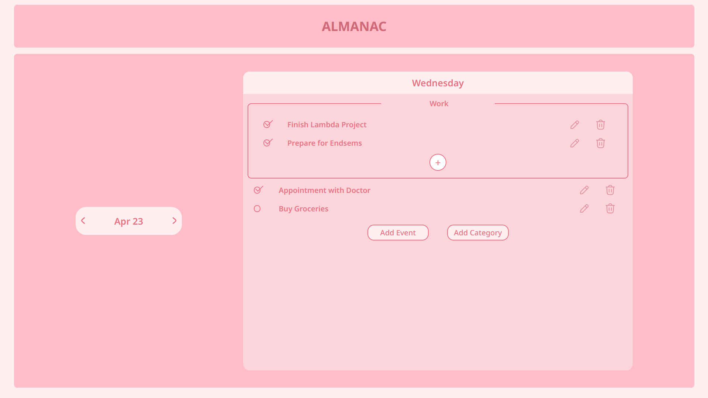

# Almanac - Smart To - Do List Site

 

## Features

✅ **Date-Specific Todo Lists**  
- Every date maintains its own separate todo list
- Easily navigate between dates while preserving all tasks

🗂 **Smart Categorization**  
- Create unlimited custom categories
- Organize tasks into different projects or contexts

🔁 **Persistent Storage**  
- All data saved automatically in browser localStorage
- No data loss between sessions

🎨 **Clean Interface**  
- Intuitive date navigation

🚀 **Available Online**  
- Hosted at almanac-todosite.com

## Usage

1. Select Date for which To Do List is to be created.

2. For general events, use "Add Event" to add.

3. For specific tasks belonging to particular category, use "Add Category" and proceed

4. Keep name of categories by selecting "Category" and altering it.

5. A Category can be deleted by erasing the name of category (if any)

6. Easily navigate between the dates, using "next" and "previous", each at side of date displayed.

